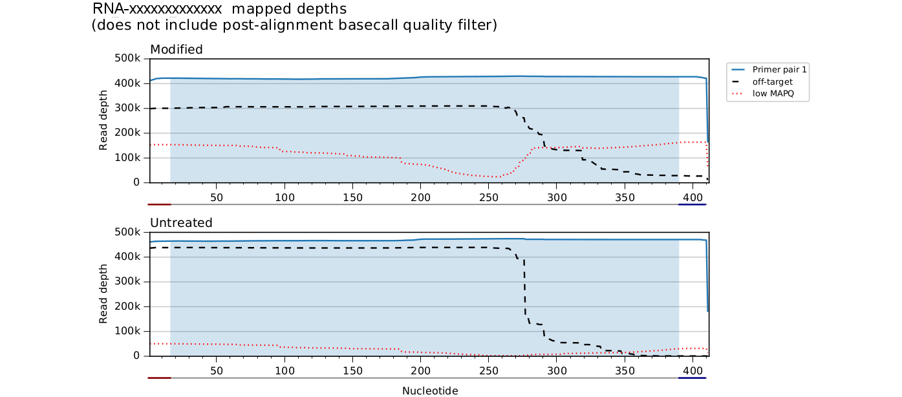
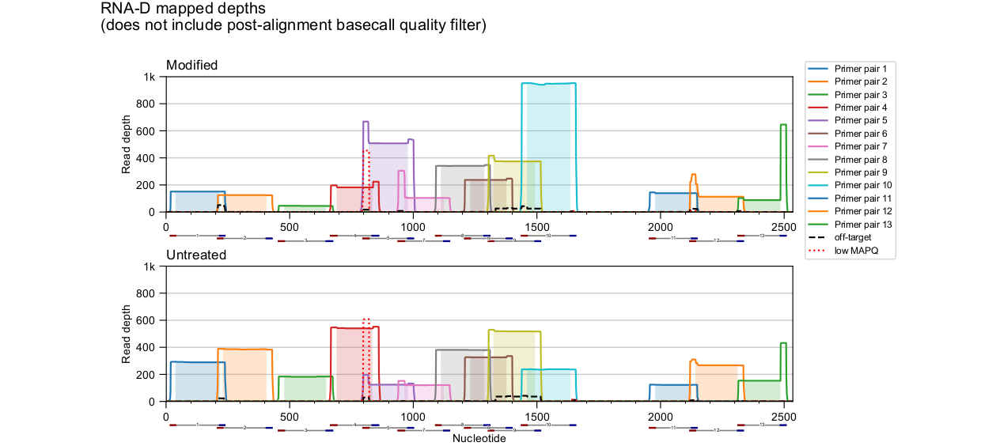
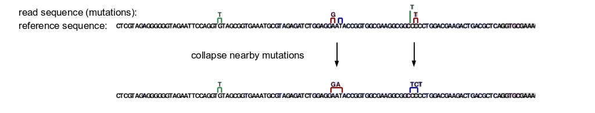
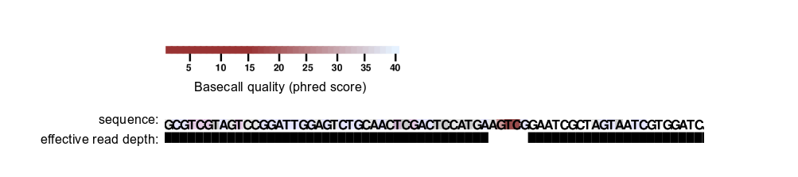
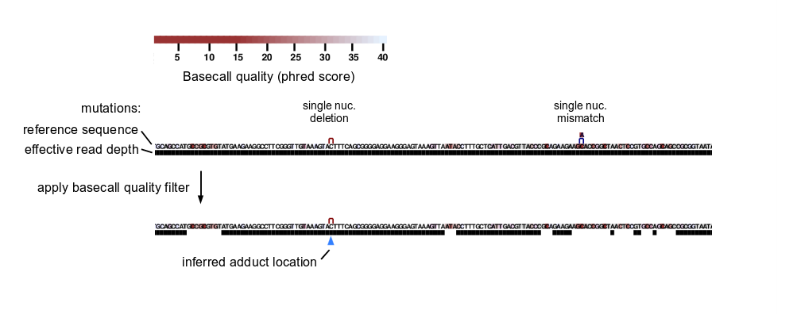
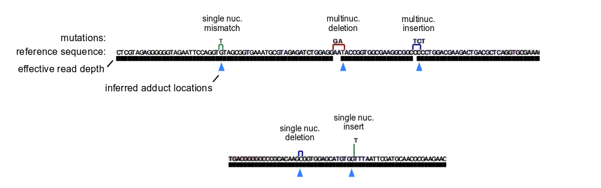
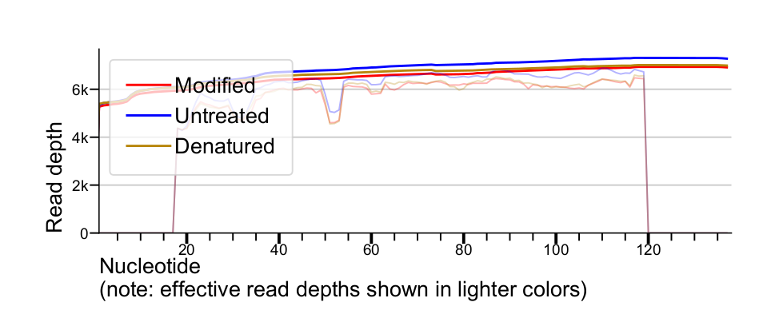
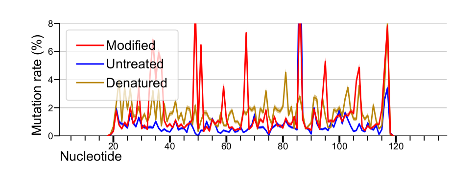
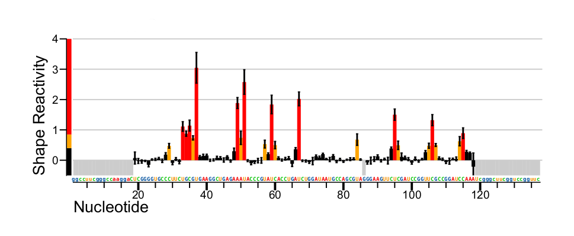

<!---
NOTE:
If you're reading this, instead try opening README.html in a web browser 
or view this file from within the github repository website.

This is a github-flavored markdown file not meant to be easily readable.
-->

Analysis steps
==============

- [Optional reference sequence correction](#optional-reference-sequence-correction)
- [Read basecall quality trimming](#initial-basecall-quality-trimming)
- [Paired read merging](#paired-read-merging)
- [Alignment to reference sequences](#alignment-to-reference-sequences)
- [Primer trimming and enforcement of read location requirements](#primer-trimming-and-enforcement-of-read-location-requirements)
- [Ambiguously aligned mutation handling](#ambiguously-aligned-mutation-handling)
- [Multinucleotide mutation handling](#multinucleotide-mutation-handling)
- [Post-alignment basecall quality filtering](#post-alignment-basecall-quality-filtering)
- [Chemical adduct location inference](#chemical-adduct-location-inference)
- [Calculation of mutation rates](#calculation-of-mutation-rates)
- [Reactivity profile calculation and normalization](#reactivity-profile-calculation-and-normalization)
- [Quality control checks](#quality-control-checks)

Steps are listed in order of execution, with the exception of
reference sequence correction, which is a larger preprocessing
stage that includes many of the other listed stages.

---
&nbsp;&nbsp;&nbsp;&nbsp;

Optional reference sequence correction
--------------------------------------
If ShapeMapper is given 
<kbd>--correct-seq</kbd> and reads from an unmodified sample,
reference sequences will be automatically corrected before any SHAPE analysis.
Specifically, ShapeMapper performs sequence alignment, identifies mutations
occurring with frequencies above 60%, and changes the reference sequence(s)
to match. Adjusted FASTA files are produced in the main output folder, and 
the ShapeMapper log will include messages detailing the sequence changes made
and warning if other high but sub-threshold mutations are detected.

This sequence correction is useful for cases in which one major RNA species is
present and contains sequence changes compared to a reference sequence (such as
when studying an RNA virus whose sequence may have drifted from a reference strain).
However, this is insufficient for samples containing a mixture of related but unknown
sequences (such as studying an mRNA in the presence of transcribed pseudogenes of 
similar sequence). In such cases, see [FAQ](FAQ.md#multiple-loci).

#### Details
Reads with aligner-reported mapping qualities (SAM MAPQ field) below 10 are excluded
within this stage.

Within this stage, nearby 
mutations are _not_ treated as larger multinucleotide 
mutations, and ambiguously aligned mutations are _not_ realigned, 
since these operations make it more difficult to estimate the frequency of SNPs.
This is different compared to how mutations are handled when estimating relative 
SHAPE adduct frequencies - see [Multinucleotide mutation handling](#multinucleotide-mutation-handling)
and [Ambiguously aligned mutation handling](#ambiguously-aligned-mutation-handling).

#### Parameters
<kbd>--min-seq-depth</kbd> &emsp; Minimum read depth required to include a mutation at a given position.

<kbd>--min-freq</kbd> &emsp; Minimum estimated mutation frequency to include a mutation.

#### Example command line
`shapemapper --name example --target TPP.fa --out --amplicon TPP_mutant --correct-seq --folder TPPminus --modified --folder TPPplus --untreated --folder TPPminus`

---
&nbsp;&nbsp;&nbsp;&nbsp;

Initial basecall quality trimming
---------------------------------
Reads are scanned from left to right, and if a window of 
<kbd>--window-to-trim</kbd> nucleotides
is found with less than 
<kbd>--min-qual-to-trim</kbd> 
average basecall quality score (phred score),
that window and any nucleotides to the right are removed from the read. If the remaining
read is shorter than 
<kbd>--min-length-to-trim</kbd>
, it is removed 
(for file formatting purposes, 
it is actually set to a placeholder read containing one 'N', 
and later ignored in alignment).

The default trimming settings are intentionally somewhat permissive, and will allow reads through
with some bad basecalls, especially if bad basecalls are isolated (i.e. a single bad
position rather than a run of them). After alignment, a more stringent filtering step will 
exclude bad basecalls from contributing to identified mutations and effective read depths.
See [Post-alignment basecall quality filtering](#post-alignment-basecall-quality-filtering).

---
&nbsp;&nbsp;&nbsp;&nbsp;

Paired read merging
-------------------
If paired reads are provided as input 
(with 
<kbd>--folder <folder></kbd> 
or with 
<kbd>--R1 <r1.fastq> --R2 <r2.fastq></kbd>
),
read pairs are merged using [BBmerge v37.78](https://sourceforge.net/projects/bbmap/) with
the <kbd>vstrict=t</kbd> option. Unmerged reads are *not* thrown out. 

Reads after this stage of processing can be optionally output by passing the
<kbd>--output-processed-reads</kbd> option.

---
&nbsp;&nbsp;&nbsp;&nbsp;

Alignment to reference sequences
--------------------------------
Read alignment to one or more reference sequences is performed with either
[Bowtie2 v2.3.4.3](http://bowtie-bio.sourceforge.net/bowtie2/index.shtml) (default), or
[STAR v2.5.2a](https://github.com/alexdobin/STAR) by passing the 
<kbd>--star-aligner</kbd> option. Intermediate read alignment
files (`*.sam`) from this stage can be optionally output by passing the 
<kbd>--output-aligned</kbd> 
option.

### General considerations

#### Choice of aligner
Both aligners produce nearly identical reactivity profiles for a SHAPE dataset from 
extracted _E. coli_ ribosomal RNA, read out by MaP in randomly primed format (see
SFig. 6 in [Busan and Weeks, 2018](http://rnajournal.cshlp.org/content/early/2017/11/07/rna.061945.117)).

Bowtie2 is the best choice for general use. STAR can be a good choice for long or
many reference sequences (such as aligning to viral genomes, lncRNAs, or many mRNAs), and is often
dramatically faster than Bowtie2 for large reference sequences. However, STAR's performance
may suffer if a sizable fraction of input reads do not map to any input reference sequence.
At least with the current parameters used by ShapeMapper, STAR may also be slightly less sensitive
than Bowtie2 (that is, it may fail to align a small fraction of reads that "should have" aligned).

#### Soft clipping
Alignments are performed in local mode (also known as soft-clipped), that is,
attempting to maximize alignment score over a sizable fraction of the read length, but
removing positions on either end that do not agree with the reference sequence. This
helps exclude bad basecalls within the first few nucleotides of sequencing and most adapter sequence.
In practice, soft clipping seems to largely obviate the need for an explicit adapter trimming step (not included
in ShapeMapper). Soft clipping can be disabled in ShapeMapper with the 
<kbd>--disable-soft-clipping</kbd>
option, but this is not recommended.

#### Read length
Both STAR and Bowtie2 are short 
read aligners, and will not perform well (and will very likely crash) on
extremely long reads, such as those produced by PacBio or Oxford Nanopore
sequencing platforms. This is an area for future work, and will involve
incorporating a long-read aligner into ShapeMapper. If existing long-read 
alignments can be coerced into a SAM format, it may be possible to run
`internals/bin/shapemapper_mutation_parser` followed by `internals/bin/shapemapper_mutation_counter`, 
but this is untested.

#### Paired read handling
If input reads are unpaired (<kbd>--U</kbd> or <kbd>--unpaired-folder</kbd>),
all reads are aligned in unpaired mode. If input reads are paired 
(<kbd>--R1</kbd>|<kbd>--R2</kbd> or <kbd>--folder</kbd>), merged
reads are aligned in unpaired mode, and unmerged reads are aligned
in paired mode.

### Aligner parameters
For reference, the parameters passed to each aligner are explained here. Most
of these parameters are _not_ adjustable by the ShapeMapper user.

#### Bowtie2 parameters

<kbd>-p</kbd> with the value of ShapeMapper's <kbd>--nproc</kbd> (default=4). 

<kbd>--local --sensitive-local</kbd> is used, unless the ShapeMapper parameter 
<kbd>--disable-soft-clipping</kbd>
   is given, in which case 
<kbd>--end-to-end --sensitive</kbd> is used.

<kbd>--maxins</kbd> with the value of ShapeMapper's 
<kbd>--max-paired-fragment-length</kbd> (default=800).

<kbd>--ignore-quals</kbd>

<kbd>--no-unal</kbd>

<kbd>--mp 3,1</kbd> &emsp; Intended to be slightly more consistent with STAR's alignment parameters.

<kbd>--rdg 5,1 --rfg 5,1</kbd> &emsp; Reduce penalty for gap extension, since multinucleotide deletions are often a large part of MaP signal.

<kbd>--dpad 30</kbd> &emsp; Allow somewhat larger deletions than bowtie2 default.

If <kbd>--max-reseed</kbd> and/or <kbd>--max-search-depth</kbd> is provided, explicit params 
"-D <max_search_depth> -R <max_reseed> -N 0 -L <seed_len> -i S,1,0.75" are used instead of 
<kbd>--sensitive</kbd> or <kbd>--sensitive-local</kbd>, where
seed_len is 20 by default, or 22 if <kbd>--disable-soft-clipping</kbd> is provided.

<h4><i>Other notes:</i></h4>

Merged and unmerged reads are provided to bowtie2 through a single tab6-formatted input, 
which supports mixed paired/unpaired reads.

#### STAR parameters

<kbd>--runThreadN</kbd> with the value of ShapeMapper's <kbd>--nproc</kbd> parameter (default=4). 

<kbd>--alignEndsType Local</kbd> is used, unless the ShapeMapper parameter 
<kbd>--disable-soft-clipping</kbd>
   is given, in which case <kbd>--alignEndsType EndToEnd</kbd> is used.

<kbd>--scoreGap -1000000</kbd> &emsp; Disable splice junction detection.

<kbd>--scoreDelBase -1 --scoreInsBase -1</kbd> &emsp; Reduce penalty for gap extension, since multinucleotide deletions are often a large part of MaP signal.

<kbd>--outFilterMismatchNmax 999 --outFilterMismatchNoverLmax 999</kbd> &emsp; Disable filtering by mismatch counts, since highly modified RNAs will produce some reads with many mutations.

<kbd>--outMultimapperOrder Random --outSAMmultNmax 1</kbd> &emsp; Only report one of the top alignments for a read that has an equivalent alignment score at multiple locations.

<kbd>--outSAMattributes MD</kbd> &emsp; Include MD tag in SAM output (currently required by ShapeMapper mutation parser).

<h4><i>Other notes:</i></h4>

STAR does not appear to have an option analogous to bowtie2's 
<kbd>--maxins</kbd>, so ShapeMapper
reimplements a check for concordant paired alignment in the mutation parsing stage.

To build a reference sequence index, STAR is run
with <kbd>--genomeSAindexNbases</kbd> and 
<kbd>--genomeChrBinNbits</kbd> parameter values calculated as 
recommended by the STAR manual.

Some STAR runs with short reference sequences may 
nonetheless crash, which may require manually setting the 
<kbd>--genomeSAindexNbases</kbd> parameter
to a lower value (this parameter is available through the main ShapeMapper executable).
ShapeMapper can be configured to automatically rerun analyses in which STAR
segfaulted by providing 
<kbd>--rerun-on-segfault</kbd>
and 
<kbd>--rerun-genomeSAindexNbase</kbd>
(default=3).

Since STAR does not support mixed paired/unpaired input, two separate STAR instances are
run, which may increase memory requirements if especially large reference sequences are used. 
ShapeMapper disables STAR's shared-memory index mode by default, but it can be re-enabled by providing
<kbd>--star-shared-index</kbd> (untested).

---
&nbsp;&nbsp;&nbsp;&nbsp;

Primer trimming and enforcement of read location requirements
-------------------------------------------------------------
If <kbd>--amplicon</kbd> and/or <kbd>--primers</kbd> with a [primers file](#primers-file) are
provided, [directed primer trimming](#directed-primer-trimming) is performed.
Otherwise, [random primer trimming](#random-primer-trimming) is performed, 
using the value of <kbd>--random-primer-len</kbd>.

### Random primer trimming
Mutations overlapping 
<tt>(</tt><kbd>--random-primer-len</kbd><tt> + 1)</tt> 
nucleotides on the 3′ end
of reads are discarded, and 
<tt>(</tt><kbd>--random-primer-len</kbd><tt> + 1)</tt> nucleotides are 
also excluded from contributing to effective read depth.

This trimming is not needed for Nextera-style preps, as
the ends of cDNAs are largely digested away before sequencing.

### Directed primer trimming
For amplicon datasets, reads are required to align with their ends within
+/- 
<kbd>--max-primer-offset</kbd> 
nucleotides of expected PCR primer pairs. This can help to
reduce the effects of off-target reverse transcription and PCR products 
(especially shorter products).

Specifically, for unpaired, paired, or merged reads, each read end is required to 
align within <kbd>--max-primer-offset</kbd>
of a primer end location, and the nearest primer sites for each end are required to
come from the same primer pair. For paired reads missing a mate pair, only one end
is required to map near a primer (out of forward primers for reads on the forward strand 
and out of reverse primers for reads on the reverse strand).

Reads whose aligned locations do not meet requirements are excluded from further
analysis, and the locations of these reads are shown in mapped depth plots as 
dashed black lines, labeled "off-target".

For reads meeting requirements, mutations overlapping either primer site are
discarded, and primer sites are excluded from contributing to effective read depth.

#### Usage
For most users, simply set primer binding sites to lowercase sequence in the input
.fa file, and run ShapeMapper with the <kbd>--amplicon</kbd> option. This will handle
cases with a single pair of primers on either end of the target.

For more complex cases with internal PCR primer locations or multiple pairs of primers, run 
ShapeMapper with a [primers file](file_formats.md#primers-file) 
input with 
<kbd>--primers <primers_file></kbd>
. ShapeMapper will automatically determine
the expected locations of input PCR primers by comparing their sequences with those of
reference targets.

### Excluding reads aligning to multiple locations
Reads with aligner-reported MAPQ values below 
<kbd>--min-mapq</kbd> 
are excluded from further analysis.
The mapped locations of these excluded reads are shown in mapped depth plots
as dotted red lines, annotated "low MAPQ". 

If multiple RNA targets share much of their sequence, low MAPQ reads typically lack
enough sequence unique to one particular target. In
other cases, low MAPQ reads are simply short, low complexity reads that spuriously
align to multiple homopolymeric portions of a target sequence.

__Note:__ When using Bowtie2, high numbers of mutations in a read will result in lower 
aligner-reported mapping qualities. Therefore, raising the value of <kbd>--min-mapq</kbd> 
may have the side effect of excluding highly mutated reads.

### Mapped depth plots
ShapeMapper produces `*_mapped_depths.pdf` files in the main output folder
to visualize the effects of this analysis stage and, with directed primers,
to break down the contributions of each primer pair to overall read depth.

*Example plots:*

Only reads plotted with solid lines are used in further analysis, and only
the shaded portion of each amplicon is included.

Multiple, even overlapping primer pairs are supported. Note in the above plot
that apparent primer dimer or leftover primer reads are excluded -
see for example the unshaded regions of the green rightmost primer pair 13.

---
&nbsp;&nbsp;&nbsp;&nbsp;

Post-alignment paired read merging
----------------------------------
For paired reads that fail to merge before alignment, but where both
mates align to the same target for a fragment size <=
<kbd>--max-paired-fragment-length</kbd>
, ShapeMapper merges the mates into a single
read, resolving any sequence or mutation conflicts attempting to favor
higher-quality basecalls.

#### Basecall quality score resolution
At a given position where mate pairs overlap, the higher basecall quality score
is used for the merged read.

#### Mutation resolution
Mutations that overlap are first grouped. For each group of mutations,
the mean phred score over
the set of basecalls within and adjacent to R1 mutations
is compared to the mean phred score over R2 mutations
and adjacent positions. The read mutation group with the higher mean phred score is
then used for the merged read. This strategy avoids rare cases in which
a more naïve mutation resolution algorithm results in a merged read that is 
incompatible with both mate pairs.

---
&nbsp;&nbsp;&nbsp;&nbsp;

Ambiguously aligned mutation handling
-------------------------------------
Early versions of ShapeMapper entirely excluded ambiguously aligned mutations
from analysis, since they make it impossible to infer adduct location
with full single nucleotide accuracy. However, short ambiguous deletions
are a fairly large signal within many MaP datasets, and we find that
realigning ambiguous mutations 5′ and including them in analysis 
produces empirical improvements in reactivity profile accuracy. 
See SFig. 2 in [Busan and Weeks, 2018](http://rnajournal.cshlp.org/content/early/2017/11/07/rna.061945.117).
The default behavior (5′ realignment) can be reversed (3′ realignment) by
passing the 
<kbd>--right-align-ambig</kbd> 
option (not recommended).

*Example realignment:* A five-nucleotide deletion can be equivalently
aligned to two locations. ShapeMapper uses the 5′ location.

    3′ aligned read:  GAGGAAGGTGGGGATGACGTCA-----TCATGGCCCTTACG
    5′ aligned read:  GAGGAAGGTGGGGATGAC-----GTCATCATGGCCCTTACG
             target:  GAGGAAGGTGGGGATGACGTCAAGTCATCATGGCCCTTACG
                                            ^
                                            inferred adduct site

We hypothesize that most short ambiguous deletions are a result of 
reverse transcriptase encountering an adduct, then stalling until a 
few nucleotides of the cDNA strand locally melt and reanneal to another 
complementary position within the RNA a few nucleotides toward the 5′ end. 

Repeat and/or homopolymeric regions still pose difficulties for MaP, both due to
high background reverse transcriptase mutagenesis within these regions and 
due to frequent loss of information regarding adduct position. Future
ShapeMapper versions may track and warn the user about such regions.

---
&nbsp;&nbsp;&nbsp;&nbsp;

Multinucleotide mutation handling
---------------------------------
We observe that  SuperScript II reverse transcription
under MaP conditions on SHAPE-modified RNA produces some reads
with multiple nearby mutations, and hypothesize that many of these
mutation clusters in fact reflect single adducts toward the 3′ end
of a given cluster. ShapeMapper therefore applies a mutation separation
threshold to collapse nearby mutations.

Mutations separated by less than <kbd>--min-mutation-separation</kbd> unchanged 
reference sequence nucleotides are collapsed and treated as a single mutation.
This is not applied within sequence correction stages if present (
<kbd>--correct-seq</kbd>
samples).
The default mutation separation threshold (6 nucleotides) was empirically 
selected to maximize reactivity profile accuracy for an 
extracted _E. coli_ rRNA SHAPE dataset
(see SFig. 1 in [Busan and Weeks, 2018](http://rnajournal.cshlp.org/content/early/2017/11/07/rna.061945.117)).
The same threshold also appears optimal for DMS adducts (unpublished data). Alternative 
reverse transcriptases, reverse transcription conditions, or adduct chemistries
may require re-optimization.

_Example:_ 

---
&nbsp;&nbsp;&nbsp;&nbsp;

Post-alignment basecall quality filtering
-----------------------------------------
Initial read quality trimming is fairly permissive to support
high read depths and to permit reads with a few bad basecalls
to be used as long as bad basecalls are isolated (see
[Initial basecall quality trimming](#initial-basecall-quality-trimming)).

After alignment, ShapeMapper applies a separate, more stringent
basecall quality filter to remove mutations and read depths associated
with basecalls with quality scores below 
<kbd>--min-qual-to-count</kbd>. 
For sequencing runs of mixed quality (such as runs approaching the length
limits of Illumina chemistry), this strategy enables recovery of 
high read depths without sacrificing reactivity profile accuracy.
See SFig. 1 in [Busan and Weeks, 2018](http://rnajournal.cshlp.org/content/early/2017/11/07/rna.061945.117).

Specifically, 
for each nucleotide position not within mutations (that is, a position covered by a read
but unchanged from reference sequence), a given position is excluded if its basecall,
the basecall immediately 5′, or the basecall immediately 3′ has
a quality score below <kbd>--min-qual</kbd>.

A given mutation is excluded (and the covered sequence region) if it contains
any basecall with quality score below <kbd>--min-qual</kbd>, or if 
the basecall immediately 5′ or the basecall immediately 3′ has
a quality score below <kbd>--min-qual</kbd>.

_Example 1:_

A poorly scoring portion of the read is excluded from analysis.

_Example 2:_

Poorly scoring regions of the read are excluded, and one mutation 
associated with low-quality basecalls is excluded.

---
&nbsp;&nbsp;&nbsp;&nbsp;

Chemical adduct location inference
----------------------------------
ShapeMapper infers the locations of chemical adducts as the reference 
sequence position immediately 5′ of the last unchanged reference
nucleotide before a mutation scanning 3′→5′ (as in reverse transcription).

_Examples:_

---
&nbsp;&nbsp;&nbsp;&nbsp;

Calculation of mutation rates
-----------------------------
### Mutation and read depth counting
After all mutation and read depth processing and filtering
steps are performed, ShapeMapper sums mutation counts and
read depths for each position in each RNA sequence.

### Effective read depth
Simple sequencing read depths are computed as the number of reads crossing
a given position in the target sequence. For computing mutation rates,
however, these depths are somewhat inadequate. The mutation rate at a 
given position should be computed as the number of observed mutations
divided by the total number of observations (i.e. the number of
"no mutation" observations plus the number of "mutation" observations).

A given position within the region covered by a multinucleotide mutation is
not actually an observation of "no mutation" - we are effectively blind
over these regions in individual reads. To help account for this, the region over
each mutation is excluded from contributing to the effective read depth, 
with the exception of the inferred adduct site (see examples above). This
correction is not applied to sequence correction stages. In practice, 
excluding multinucleotide sites from read depths is usually a small change 
to a large denominator, and has a negligable effect on reactivity profile 
accuracy, at least with mutation rates in the range produced by SHAPE adducts. 

Effective read depths as reported by ShapeMapper also exclude low quality
basecalls (see [Post-alignment basecall quality filtering](#post-alignment-basecall-quality-filtering)).

_Optional outputs:_ 

Intermediate parsed and processed mutations associated
with individual reads can be optionally output by passing the
<kbd>--output-parsed-mutations</kbd> option
(see [file format](file_formats.md#parsed-mutations)).

Tables of mutation counts broken down by mutation classification
can be optionally output by passing the 
<kbd>--output-counted-mutations</kbd>
(see [file format](file_formats.md#mutation-counts)).

Tabular histograms of read lengths and per-read mutation counts
can be optionally output in the main ShapeMapper log by passing
the <kbd>--per-read-histograms</kbd>.

### Rate calculation
At each position in a given RNA, mutation rate 
for each provided sample is calculated as the mutation count 
divided by the effective read depth at that position. In 
output tab-delimited `*_profile.txt` files, the relevant 
columns are `<sample>_mutations` (mutation counts), 
`<sample>_effective_depth` (effective read depths), and
`<sample>_rate` (mutation rate).

_Output plots:_
`*_profiles.pdf` output files include panels for read depths and
mutation rates. 

Read depths for each sample are plotted with solid lines,
and effective read depths are plotted with
light lines. 

Mutation rates plotted with
lines, and standard errors plotted as shaded areas. Mutation rate standard
errors are calculated as `sqrt(mutation rate) / sqrt(effective depth)`.

---
&nbsp;&nbsp;&nbsp;&nbsp;

Reactivity profile calculation and normalization
------------------------------------------------
_Sample key:_ `M`: Modified, `U`: Untreated control, `D`: Denatured control

#### Reactivity
If three samples are provided, reactivity is calculated as
 
&emsp;&emsp; <tt>(rateM - rateU) / rateD</tt>

If two samples are provided, reactivity is calculated as

&emsp;&emsp; <tt>rateM - rateU</tt>

If only one sample is provided, reactivity is simply

&emsp;&emsp; <tt>rateM</tt>

#### Standard error
If three samples are provided, reactivity stderr is calculated as

&emsp;&emsp; <tt>sqrt( stderrM / rateD)2 +
               (stderrU / rateD)2 +
               (stderrD × (rateM - rateU) / rateD2)2 )</tt>

where rate and rate stderr are calculated as [above](#calculation-of-mutation-rates).

If two samples are provided, reactivity stderr is calculated as

&emsp;&emsp; <tt>sqrt(stderrM2 + stderrU2)</tt>

If only one sample is provided, reactivity stderr is simply

&emsp;&emsp; <tt>stderrM</tt>

Reactivity standard errors are shown as error bars in `*_profile.pdf` plots.

#### Excluded positions
Lowercase sequence is excluded from reactivity profiles. Positions
with effective read depth in any sample below 
<kbd>--min-depth</kbd> 
(default=5000) are
excluded. If an untreated control sample is provided, positions with 
untreated mutation rate above 
<kbd>--max-bg</kbd> 
(default=0.05) are excluded.

#### Normalization
Over the set of all RNAs and nucleotide positions without 
masked (lowercase) sequence, high background, or low read depth, 
reactivities are normalized by dividing
by the mean reactivity of the top 10% of reactivities after 
reactivities above a threshold are excluded 
(see section 3.2.1 in [Low and Weeks, 2010](https://www.ncbi.nlm.nih.gov/pmc/articles/PMC2941709/)).
That threshold is selected from
the largest value out of

    [1.5 × interquartile range,
    90th percentile (if total seq length > 100) or 95th percentile (if total seq length < 100)].

By default, ShapeMapper normalizes all profiles together - 
that is, using the combined set of reactivities to compute 
a single normalization factor that is applied to all profiles.
This can be disabled by passing the <kbd>--indiv-norm</kbd> option.

_Example:_

_Limitations:_

SHAPE-MaP measures relative probe reactivities, and normalization
is an attempt to put these relative values on a more meaningful
scale, closer to what might ideally be achieved with an absolute
measurement of nucleotide conformational state. However, this normalization 
relies on the assumption that the distribution of observed reactivities
in a particular experiment matches the distribution of reactivities
observed in experiments used to develop pseudo-free energy structure
modeling constraint parameters. In particular, normalization
 will produce systemically incorrect results for highly single-stranded RNAs or 
extremely highly base-paired RNAs.

Future work may attempt to fit relative reactivity distributions to empirical
models of the distributions of reactivities observed for paired and unpaired
nucleotides. This would allow more accurate 
structure modeling for highly structured or highly unstructured RNAs 
as well as providing an estimate of overall base pairing percentage.

---
&nbsp;&nbsp;&nbsp;&nbsp;

Quality control checks
----------------------
ShapeMapper performs several basic quality-control checks for each 
reactivity profile. These are necessarily heuristic, since different
downstream analyses require different levels of data quality, and 
since RNAs of differing flexibility will show different overall
signal levels above background. In general, more sequencing read 
depth is always helpful, as are higher modification/mutation rates 
(to a point).

If ShapeMapper gives a red warning message about possible low-quality
reactivity profiles, read the log file to see which quality control
checks failed, and refer to this section for possible remedies.

#### Read depth check

ShapeMapper requires that at least 80% of non-masked nucleotides meet a minimum
sequencing depth of 5000 in all provided samples. Note that with
uneven sequencing coverage, some regions of an RNA may have 
higher-quality reactivity data than other regions. For example, 
coverage is often lower near transcript ends.

If read depths are low, check alignment stats in the logfile to see the 
amount of target sequence present in each sample. Better target enrichment or 
recovery and/or additional sequencing can often help.

#### Positive mutation rates above background check

If an untreated control sample is provided (highly recommended), ShapeMapper
requires that at least 50% of non-masked nucleotides with depths above
5000 have a higher mutation rate in the modified sample than in the 
untreated sample.

#### High background mutation rates check

If an untreated control sample is provided, ShapeMapper requires that no more
than 5% of non-masked nucleotide with depths above 5000 have an
untreated mutation rate above 0.05.

An unusual number of high-background nucleotides can result from the
presence of native modifications or, more often, a subpopulation of 
sequence variants or transcribed pseudogenes. There is no
built-in method to automatically determine the sequences of multiple
sequence variants in a mixture, but it can sometimes be helpful to
pass the <kbd>--render-mutations</kbd> option and visually inspect the PDF outputs 
from the untreated sample, looking for repeated instances of the same
mutation pattern from distinct reads. By default, these outputs are limited to
100 pages, controlled with the 
<kbd>--max-pages</kbd> parameter. The pages are wide enough
by default to accomodate a maximum paired read length of 800 nts, but this is
often very zoomed out; lower the 
<kbd>--max-paired-fragment-length</kbd> as needed for
visualization.

#### Number of highly reactive nucleotides check

ShapeMapper requires that at least 8% of non-masked nucleotides with depths 
above 5000 have a modified mutation rate above 0.006 after background
subtraction.

Possible causes for failure: 
- DNA contamination. Unusually low background mutation rates can 
  be a secondary indication that this is the problem (since 
  reverse transcription under MaP conditions usually generates
  some errors).
- Poor mixing of chemical reagents and RNA and/or poor reagent 
  diffusion (if modifying in cells), resulting in low 
  modification rates
- Expired reagents, resulting in low modification rates
- Poor reverse transcription conditions, resulting in low adduct 
  read-through
- Extremely highly structured RNA. A molecule that genuinely
  contains no flexible nucleotides is indistinguishable from a
  highly flexible one that was mistakenly unmodified (they will
  both have low mutation rates above background). In this case, 
  additional control experiments or complementary techniques may 
  be needed.

&nbsp;&nbsp;&nbsp;&nbsp;

[← back to README](../README.md)
